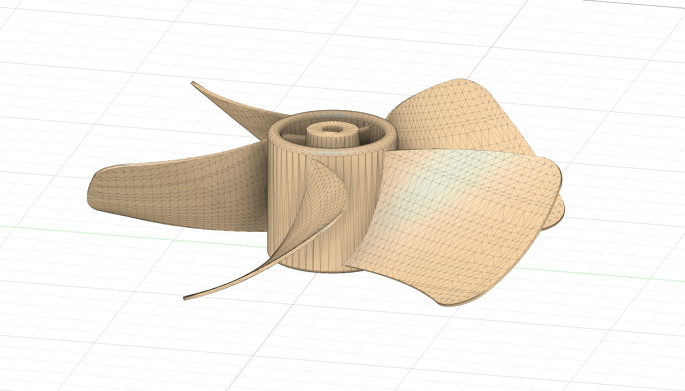
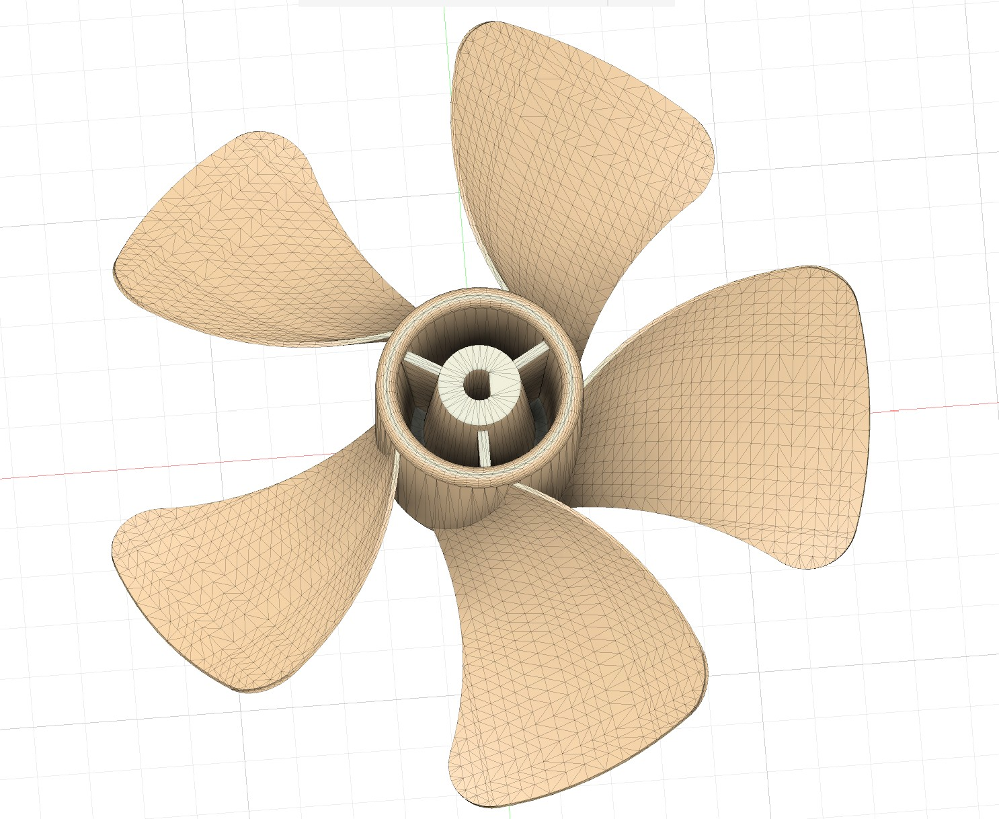
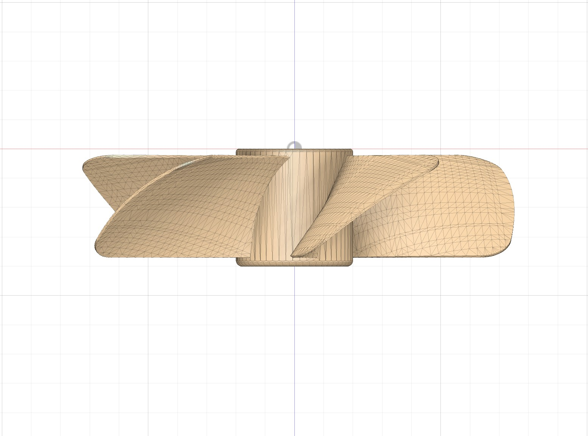
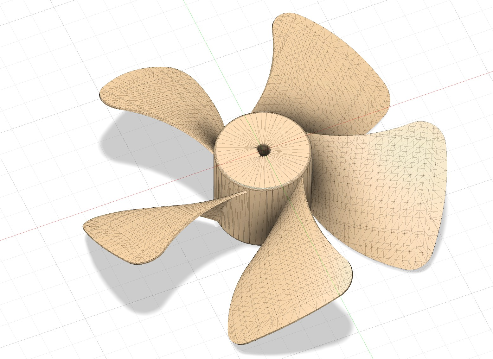

# Embedded PWM-Controlled Electromechanical Fan System

Arduino-based variable-speed fan system integrating embedded motor control, OLED telemetry, transistor-based power switching, and custom 3D-printed mechanical components.

---

## Features

- PWM-controlled 12V DC motor
- Potentiometer throttle input
- OLED telemetry display
- Custom 5-blade fan design
- 3D-printed motor mount
- Transistor-based power switching
- Embedded systems integration

---

## Components

- Arduino Uno
- 12V DC gear motor
- 8x AA battery pack
- 2N2222 transistor
- 1kΩ resistor
- 10kΩ potentiometer
- 0.96" I2C OLED display
- Flyback diode
- Custom 3D-printed fan assembly

---

## Mechanical Design

A custom DC motor mount was designed in Fusion 360 to securely house the 12V DC geared motor during operation. Additionally, a custom 5-blade fan assembly was designed and mounted directly to the motor shaft to create a functional variable-speed airflow system.

---

## CAD Files

The repository includes STL files for:
- Custom 3D-printed 5-blade fan
- Custom 3D-printed motor mount

Located in the `/cad` directory.

---

## Future Improvements

- RPM sensing
- Current monitoring
- Closed-loop PID control
- ESP32 wireless telemetry
- H-bridge directional control

---

## CAD Renders

